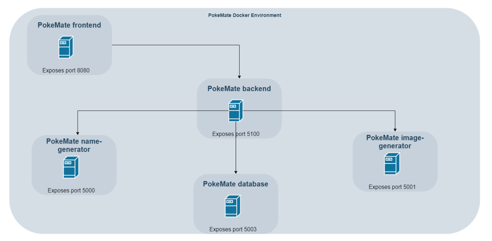

# Pokemate Deployment

## Run

Pull most recent images:

```bash
docker-compose pull
```

To run all containers, execute:

```bash
docker-compose up
# use -d option for detached mode
```

:warning: If you run the setup locally and want to access the frontend, your browser will block cross-domain requests. Thus, it is recommended to install [this Chrome extension](https://chrome.google.com/webstore/detail/moesif-orign-cors-changer/digfbfaphojjndkpccljibejjbppifbc) for testing purposes.

## Run in DEV mode

Pull most recent images:

```bash
docker-compose -f docker-compose.dev.yml pull
```

To run all containers, execute:

```bash
docker-compose -f docker-compose.yml -f docker-compose.dev.yml up
# use -d option for detached mode
```

## Architecture

The follwing image illustrates how the containers a communicating with eachother.


