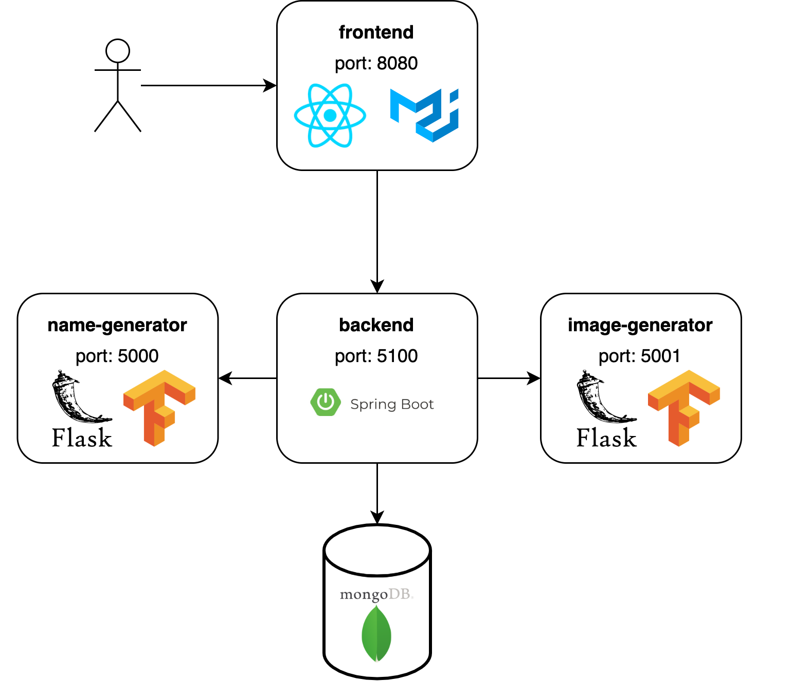

# Pokemate Deployment

## Architecture

The follwing image illustrates how the containers a communicating with eachother. Each of images is available on Dockerhub. Thus, there is no need to clone any other repositories.



## Run

Pull most recent images:

```bash
docker-compose pull
```

To run all containers, execute:

```bash
docker-compose up
# use -d option for detached mode
```


## Run in DEV mode

Pull most recent images:

```bash
docker-compose -f docker-compose.dev.yml pull
```

To run all containers, execute:

```bash
docker-compose -f docker-compose.yml -f docker-compose.dev.yml up
# use -d option for detached mode
```
